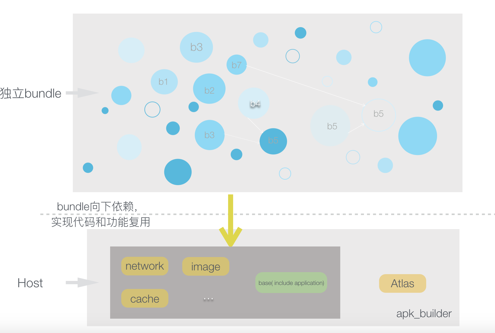

#名词解释

**Bundle:** 类似OSGI规范里面bundle（组件）的概念，每个bundle有自己的classloader，与其他bundle相隔离，同时Atlas框架下bundle有自身的资源段（PackageID，打包时AAPT指定）；另外与原有OSGI所定义的service格式不同之处是Atlas里面Bundle透出所有定义在Manifest里面的component，随着service，activity的触发执行bundle的安装，运行。

**awb：** android wireless bundle的缩写，实际上同AAR类似，是最终构建整包前的中间产物。每个awb最终会打成一个bundle。awb与aar的唯一不同之处是awb与之对应有个packageId的定义。

**host:** 宿主的概念，所有的bundle可以直接调用host内的代码和资源，所以host常常集合了公共的中间件，UI资源等。host和bundle的依赖关系如下图所示：

>

从上图也可以看出基于Atlas构建后大致工程的结构：

1. 首先有个构建整体APK工程Apk_builder,里面管理着所有的依赖（包括atlas）及其版本，Apk_builder本身可能不包含任何代码，只负责构建使用
2. host内部包含独立的中间件，以及一个Base的工程，里面可能包含应用的Application，应用icon等基础性内容（如果足够独立，application也可以直接放在apk_builder内）；
3. 业务层基本上以bundle为边界自上而下与host发生调用，同时bundle之间允许存在依赖关系；相对业务独立的bundle如果存在接口耦合建议封装成aidl service的方式保证自身封装性；同时某些中间件如果只存在若干bundle使用的也可以封装bundle的方式提供出来，以保证host内容精简

**remote bundle：** 远程bundle，远程bundle只是apk构建时并未打到apk内部，而是单独放在了云端；同时远程bundle的限制条件是第一次被触发的前提是bundle内的Activity需要被start，此时基于Atlas内的ClassNotFoundInterceptorCallback可以进行跳转的重定向，提示用户下载具体bundle，待用户确定后进行异步下载同时完成后再跳转到目标bundle（此部分代码由于涉及下载及UI展示等内容并未包含在开源仓库中，有需要可以根据ClassNotFoundInterceptorCallback自行实现）

**动态部署：** 基于Atlas的installorUpdate和atlas-update库及构建插件，可以生成与之前发布的apk diff生成的差异文件，在更新时拉取同时静默更新到设备上，在用户下次启动之后生效新代码，具体原理可以参考动态部署章节的解析
