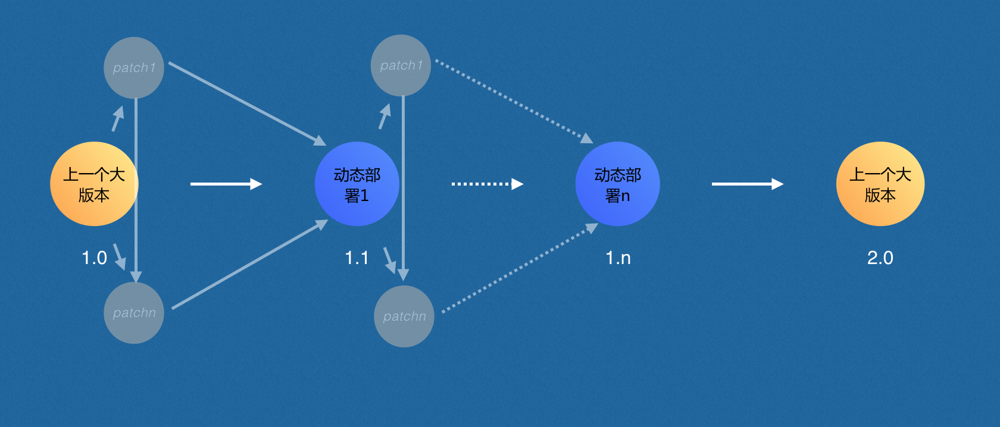

#什么是Dexpatch
DexPatch是以动态部署技术方案为基础，以快速解决线上故障为唯一目的的动态化方案。

## 为什么不用动态部署
动态部署的出发点立足于需求的快速迭代，替换普通的apk升级。所以在动态部署的演进过程中灵活性成为我们不断去追求的目标。希望不断缩小动态部署的限制以达到完全替换APK更新的能力。
正是因为其比较全面的能力，我们发现动态部署在故障修复方面存在其不足的地方：

1. **构建速度：**
在每个需求迭代过程中，考虑需求的复杂性和每次周期性迭代管理的成本，动态部署参考APK迭代的方式通过统一的集成区进行管理，所以在构建上动态部署tpatch实际上是先有整包构建，再DIFF出差异的方式，这样的方式规避了混淆、内联等带来的复杂性的问题处理，保证patch对之前版本的完全适用，但是这种方式同时也必不可少的影响patch的构建速度，在对紧急的问题进行修复的关键时期，这个时间可能会是不可接受的。

2. **生效速度：**
   1. 动态部署内有代码的变更，so，资源等。灵活性导致一个动态部署等体积往往比较大，而在运营商网络下，对用户大的流量消耗不是我们希望看到的，所以往往这种情况下只在WIFI下的生效策略很能影响生效率。
   2. 动态部署允许宿主，bundle内部发生更新，也允许bundle之间的依赖关系等发生变更，这就导致了一次动态部署成功必须依赖于tpatch内的所有bundle和宿主全部更新成功，否则就可能会导致依赖不一致而引发crash。从以往的动态部署tpatch可知，每次的变更通常都有十几个甚至几十个bundle发生变更，而在低空间或者某些读写能力较差的设备上，IO失败很容易影响整个patch的成功率。

3. **版本号：**
   因为是APk升级的替代方案，动态部署替换版本号的方式就使得是否使用的是动态部署还是apk升级对业务来说完全透明，可以继续按版本号进行逻辑处理，降级等。数据统计以及监控等可以完全兼容。但是如果在故障修复中去贸然升级版本号，虽然直观上可以清楚看到问题修复的覆盖率，但是之前优势就荡然无存了。
   
回顾手淘之前的一些故障问题的修复，不管是动态部署还是andfix，其实我们发现几乎所有的故障都可以通过java代码就行修复或者降级，也基本都可以在一个模块内的修改就把某个对应的故障修复掉。因此，以动态部署的技术作为基础，称之为**Dexpatch**的方案应运而生。

## Dexpatch的特点和优势
**限制：** 

每个dexpatch只能修改一个bundle(主dex整个算一个bundle)，且修改的代码必须向前兼容。（不如说主dex被bundle依赖，则主dex的dexpatch修改不能引起原来bundle的方法调用出现问题）

**如何发布Dexpatch:**

每个业务按照各自的故障情况进行dexpatch的构建，产出对应的patch产物和json信息，发布时平台应该汇总对应版本当前release的所有patch内容，整合json信息，进行下发

dexpatch不存在回滚，每个dexpatch发布后，直接覆盖之前的dexpatch的。每个dexpatch有下线的能力

**优势**

1. 每个bundle基于自身的问题进行dexpatch的发布，构建速度相比原来的方式有了大幅度提高，只需要针对单个bundle进行构建从而diff出差异即可。
2. 下发的dexpatch总包内的patch各自生效，不需要所有bundle的patch全部安装成功，这是由于之前patch的修改是向前兼容做了保证。

3. dexpatch由于其修改的原子性（向前兼容性的保证以及不存在关联修改），同时容器按需加载的特性，使得未被载入的bundle可以不需要进程重启即可生效，同时，已经载入的bundle后期也会进行生命周期的监控，一旦所有component退出，则也可以进行热替换，使得dexpatch相比动态部署的生效速度可以进一步提高

同时dexpatch不修改整个apk版本号，每个bundle提供额外的dexpatch版本号进行监控。

另外 dexpatch作为动态部署的补充，两者相辅相成。可以针对任何一个大版本或者动态部署版本发布dexpatch，无论一个版本号对应的bundle是否有被dexpatch，当一个新的动态部署发生时，它们又都会被收敛到一个新动态部署版本上面。
那么现在理想中的版本迭代的情况应该是如下这种：
>

