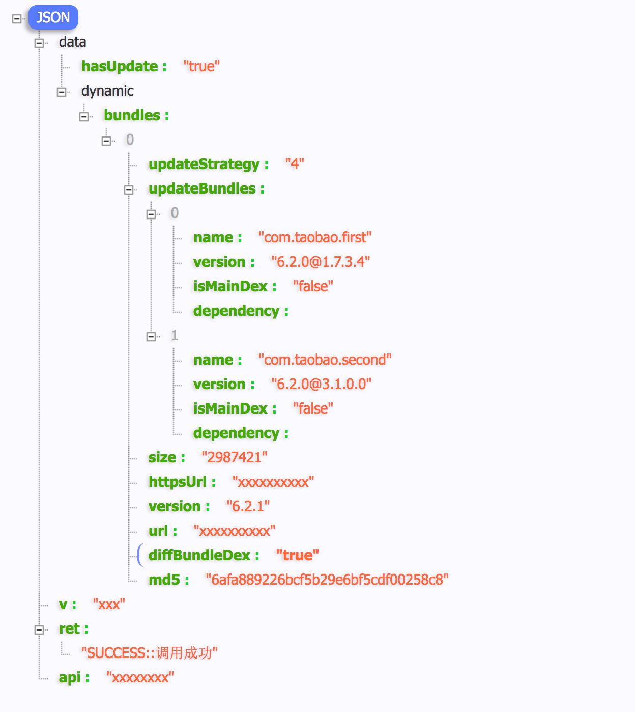
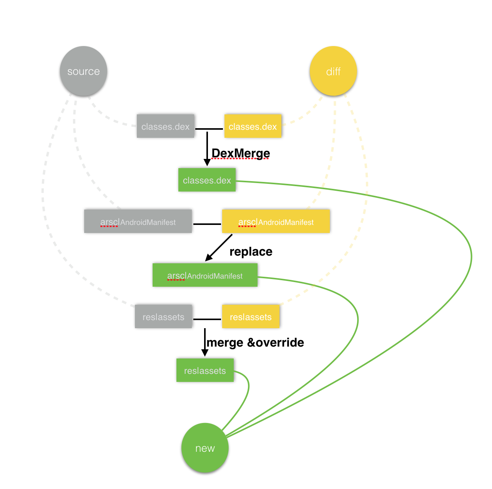
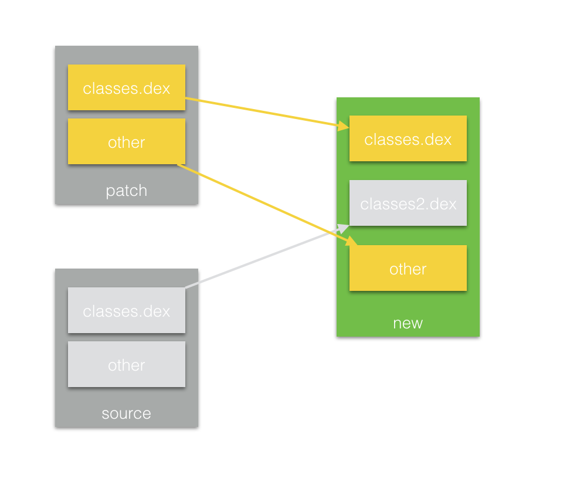
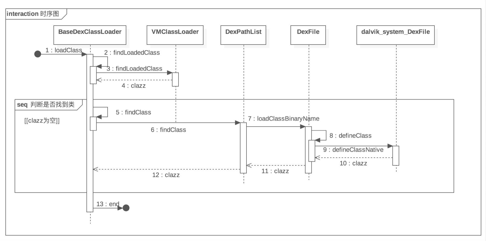
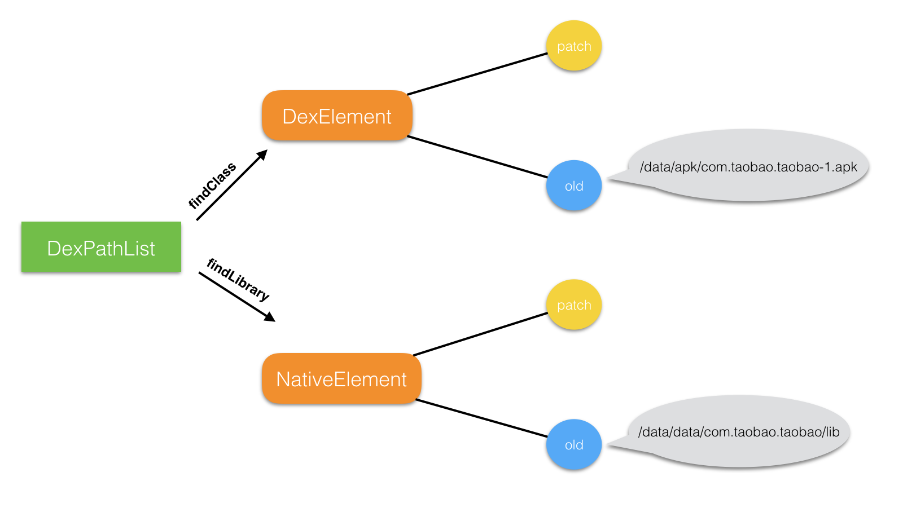
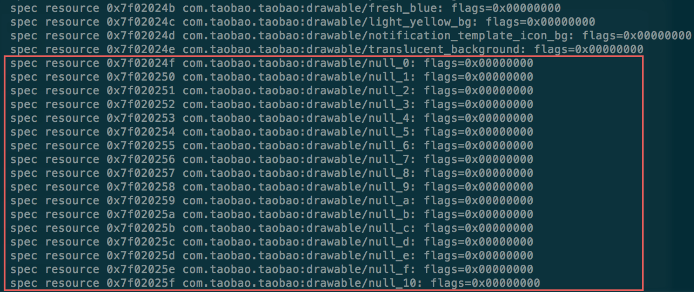
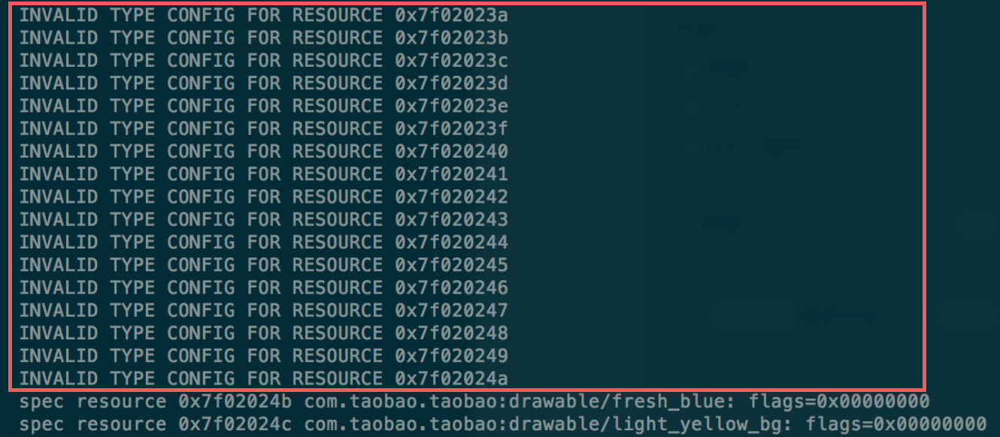
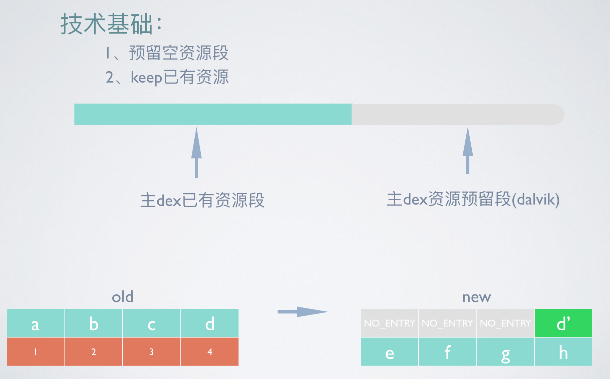

#技术原理

普通Apk的更新的过程为构建->安装->生效，与之相对应，动态部署也可以分为三个过程：

1. **构建**  不同于Apk更新产物就是一个完整的Apk，动态部署的构建产物是一个后缀为tpatch格式的文件
2. **merge** 下载到tpatch文件后，动态部署sdk会在后台完成merge到安装的过程，整个过程对用户透明
3. **生效**  merge完以后，当前的应用处于一个等待生效的状态，会在合适的时机选择进程重启来生效此次的动态部署，且在生效前不会再接收新的动态部署行为，进程重启以后表示一次完整的动态部署过程结束

下面对每个过程展开讲解下，以便更好理解整个动态部署的机制
###  构建
动态部署构建的产物为tpatch为后缀的一个压缩文件--文件名为

**patch-targetVersion@sourceVersion.tpatch**

例如手淘6.2.0部署到6.2.1的动态部署的tpatch文件为：
patch-6.2.1@6.2.0.tpatch

patch文件解压后一级目录如下图：

1. 如果有主apk的更新，则会有com_taobao_maindex.so存在，so中包含差量的classes.dex、res等
2. 如果有bundle更新，则一级目录下以bundle为粒度有多个文件夹，每个文件夹下包含差量的classes.dex，res等

**注意点：主Apk的差量与bundle的差量目前采取不同的策略，主Apk永远是与基线版本做差量；而bundle是更上一个版本做差量：比如从6.1动态部署到6.2再动态部署到6.3，则6.3中主apk的差量是6.3主apk的集成内容和基线（6.1）主apk中的内容diff出差量；6.3中bundle的差量则是与上一个版本进行diff，如果是6.2的版本去请求动态部署的tpatch，则tpatch中的bundle的差量是6.3与6.2的bundle进行diff所得，如果是6.1版本去请求6.3的动态部署的tpatch，则bundle的差量是6.3与6.1的bundle进行diff所得**
>

与tpatch文件相对于的，接口会返回该次动态部署的修改内容，数据结构如下：

数据中可以看出bundle动态部署过程bundle的依赖关系允许发生变更，同时动态部署也有一定的限制，这个会在后面单独进行说明

### Merge
merge过程在下载到tpatch且校验通过后在线程中进行，由之前Atlas容器安装目录介绍可知，假设当前bundle的版本在文件系统上为Version.1,则merge成功后新的bundle会安装在Version.2目录下，并在后续新的动态部署中版本号逐步往后追加，同时鉴于空间占用的考虑，目前的策略是会保留上一个版本（鉴于回滚的考虑）；

与bundle以包名为文件夹存放类似，主Apk更新存放的文件夹以**com.taobao.maindex**为名字，里面的版本管理与bundle一致，不同点是com.taobao.maindex只在发生过动态部署以后才会有，Version.1意味着已经发生一次动态部署；bundle通常情况下动态部署从Version.2开始（未安装过的bundle除外）

动态部署成功后，会在下次进程重启后去resolve新的bundle，resolve的策略是按版本号从高到低回溯，选择最高可用的版本使用。

下面展开介绍下在新bundle（假设主Apk当做是一个特殊的bundle）安装成功前merge的过程中bundle和主Apk在merge过程中的差异点：
#### bundle Merge
bundle的merge主要以下几个过程(如下图)

1. 获取merge的数据源：patch信息来自于bundle在下载的tpatch包中的内容，用于merge的source来自于当前设备的文件系统中，可能来自于已经安装过的bundle（storage），可能还没有安装（apk或者lib目录下）
2. 创建新的bundle zip包，classes.dex来自于source中的classes.dex和patch包中的classes.dex通过Dexmerge合并新的classes.dex
3. arsc和AndroidManifest直接使用patch包中的内容 
4. res和assets 会进行合并，如果文件没有变更（patch中没有，source中有），则直接使用source中的内容，如果有文件新增或者发生了变更（patch中有，source中有或者没有），则从patch中读取放到新的bundle包中

merge完以后接下去安装就是容器的逻辑了，如果没有安装过则在bundle目录下生成Version.1目录进行安装，如果安装过则生成新的版本目录

#### 主Apk的Merge
主Apk的Merge在dalvik和art上使用的机制有所不同，dalvik设备上没有任何merge过程，直接把libcom_taobao_maindex.so以bundle的形式安装到com.taobao.maindex目录下
Art设备上我们会根据source的apk（主apk的merge永远是基于基线版本）把classes.dex 提取出来以多dex的方式追加到libcom_taobao_maindex.so中，如果本身是多dex机制的，那么会将多个子dex全部追加进去，patch里面的classes.dex保持不变，source里面的dex的序列号往后偏移一位（classes.dex->classes2.dex,classes2.dex->classes3.dex）,如下图所示：
>

Merge安装成功后，会将bundleinfo的信息更新到baselineinfo的目录中，并在下次启动的最早时间替换掉原有的baselineinfo信息；里面的内容记录了更新的bundle的name，version以及部署成功以后的版本号等信息。
### 运行期
#### bundle的运行期加载策略：
由之前的容器的运行机制可以得知，bundle动态部署后对容器来说没有任何变化，还是按需的load bundle，只是在需要去load前版本选择上会使用最高的可用版本

#### 主apk动态部署后的加载策略

了解主Apk的加载策略之前，先分别介绍下主Apk动态部署得以成功的技术基础再阐述生效的方式：
##### class|so
这里粗略介绍下普通apk（也就是主Apk）class，so库加载入口--**PathClassLoader**
前面容器的技术原理里面介绍了PathClassLoader的父子关系，PathClassLoader自身负责主Apk的类和c库的查找路口；其parent BootClassloader负责framework sdk的内容的查找。

PathClassLoader本身也是一个class，继承了BaseDexClassLoader（同DexClassLoader），里面查找过程在DexPathList里面实现（如下图）
>

DexPathList最终通过DexFile去loadClass，DexPathList可以理解为持有者DexFile以及nativeLibrary目录，再查找的时候遍历这些对象，直到找到需要的类或者c库，那么动态部署的方式就是把新修改的内容添加到这些对象的最前面，从而使得查找的过程中新修改的内容能够提前找到从而替换原有的（如下图）

>

这里有两个注意点提及一下以加深理解：

1. **PREVERIFY:** 经过手淘打包插件构建以后，主apk里面的所有class，interface都插入了一段代码：类似下图。原因是android构建的时候会有PREVERIFY的过程，如果Class所引用到的Class均和Class自己在同一个dex内部，则会被打上PREVERIFY的标记。然后在运行期的时候如果打上这个标记的class，在载入时不需要经过verify已提高加载效率，但是运行到方法时会校验依赖的class是否跟构建时一致和Class自身处于同一个dex，如果不一致则会抛出PREVERIFY的错误。而手淘的动态部署策略必然会新生成一个dex，那么如果遇到是PREVERIFY的class的时候就会出错。所以目前手淘的策略是在编译期给每个class引用到一个不存在的class以解除PREVERIFY的限制（具体PREVERIFY的校验过程可以阅读Android源码）
>

2. **OAT的限制:**android到art后原有的dexopt会改为dex2oat，运行时代码由原来的解释执行改为直接运行native代码，之前的使用过程中发现单纯得往前面追加patch的dex并不能完全解决动态部署的问题，dex2oat的过程优化了class的执行代码，比如说内敛，虚函数的校验等。就有可能在运行过程中直接在native层执行老的优化过的class代码而不是从新patch的dex中load新的class去使用。所以art上目前的策略是把patchdex，sourcedex参考multidex的机制放入一个zip，然后合并在一起做一遍dex2oat，这样能使新的class覆盖老的class参与dex2oat并完成优化的过程，所以art上的真正的执行过程实际上在patch的dex中已经包含了所有主apk的代码，基本不会走到old dex的逻辑。（patchdex 插入前执行的代码除外） 

##### resource|assets

主Apk为了支持在Resource能够动态部署实际上同PREVERIFY的机制类似，在基线包构建的时候就已经做了处理:基于Atlas打出来的apk的资源列表中有如下内容：

>

我们取一个动态部署的tpatch包，能够看到如下内容：
>

这些是基于我们atlas-aapt的修改，dalvik上我们是基于res的overlay机制去修改资源，这个机制并不支持新增资源，在overlay的包里面如果读到了一个资源，dalvik系统会去校验该资源ID在base中值，如果不存在则抛错，所以动态部署为了利用这一特性同时支持新增资源的需求，在打基线包的时候就在每个不同的type里面预留了128个资源ID供后续动态部署使用；同时打动态部署的patch时会以之前的ID分配的内容作为输入，保证已有的资源分配到的ID保持不变，同时如果资源没有发生变更，则剔除该资源，所以aapt dump patch的时候我们看到的INVALID TYPE 的资源段没有发生变更的资源，如果有发生了变更，且之前有这个资源，就会在原有的资源ID分配过去，同时新的资源文件打入patch包或者新的资源文本写入arsc，如果是新增的资源，则使用预留的资源段进行分配。整个替换过程如下图所示：
>

在打包对资源做了一系列处理以后，运行期资源的加载只是在启动加载资源时根据系统读取资源的先后书序把patch包插入到AssetsManager的合适的位置中，assets由于没有资源ID，不需要预留，插入AssetsManager的方式类似res的处理，这里不再展开